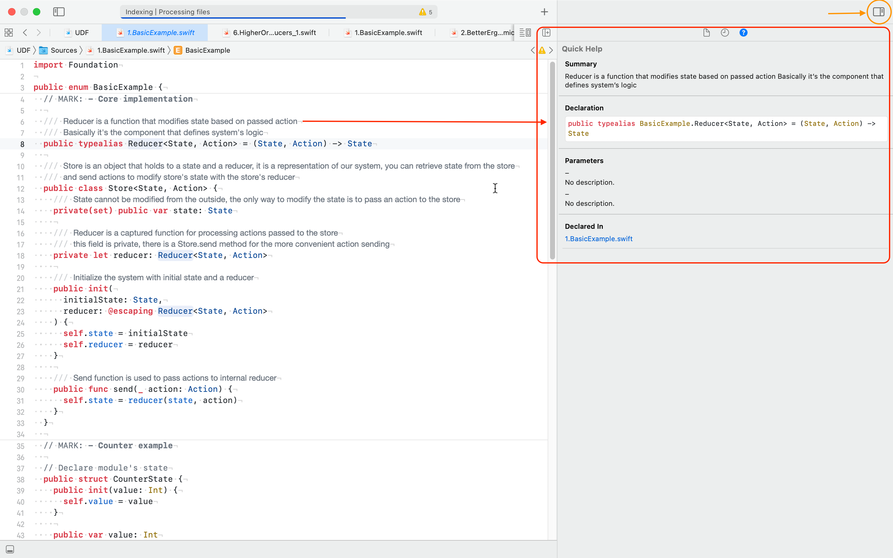

# UDF Tutorial

Step-by-step we are creating UDF framework from scratch. We take a very basic implementation, find problems and improve it to build an intuition on how do unidirectional frameworks work under the hood.

For now it's just a playground, but the format may change as the complexity grows.

> Spoiler: The final result will be close to [the composable architecture](https://github.com/pointfreeco/swift-composable-architecture)

## API

You can find step-by-step usage example at the UDF.playground root

## Implementation

You can find implementation of each step under the `Sources/<step_number>.<step_name>.swift` file in the playground. Each step has it's namespace, declared with an enum without cases (_`enum <step_name> {}`_) We will use some external helpers, imported as a source code under the `Sources/Helpers` folder (you don't have to figure out how do these external dependencies work, it is optional, but might be useful).

### Currently implemented steps

- **[1.BasicExample](UDF.playground/Sources/1.BasicExample.swift)**
- **[2.BetterErgonomics_1](UDF.playground/Sources/2.BetterErgonomics_1.swift)**
- **[3.BetterErgonomics_2](UDF.playground/Sources/3.BetterErgonomics_1.swift)**
- **[4.PerformanceImprovements_1](UDF.playground/Sources/4.PerformanceImprovements_1.swift)**
- **[5.PerformanceImprovements_2]((UDF.playground/Sources/5.PerformanceImprovements_2.swift))**
- **[6.HigherOrderReducers_1](UDF.playground/Sources/6.HigherOrderReducers_1.swift)** _`Draft`_

## How to use the tutorial?

Open `UDF.playground` in Xcode. At the root of the playground you can find notes on how to use our UDF framework at each step. Read the tutorial line-by-line. Notice, that at the beginning of each section we encourage you to navigate to implementation and find out how things work and what was changed on each step (read comments line-by-line for some help, Xcode docs may help you to read comments a bit easier)

  

